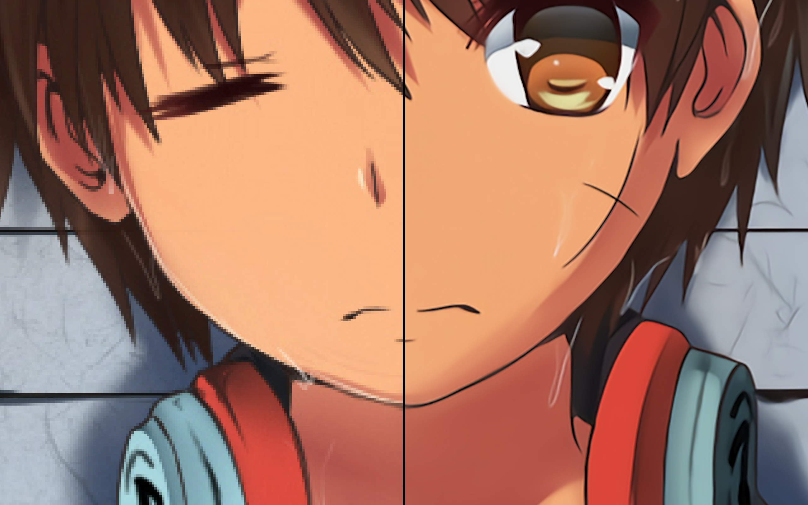

# BMP Super Resolution

A simple test for CNN based BMP super resolution

100% C language

## Effect

For test, I use a picture from pixiv by
[(ˉ﹃ˉ)EM1234](https://www.pixiv.net/member.php?id=8467971)

This is a effect preview:

The left is origin and the right is preview after two times convert (Resolution 4 times up!)

I don't supposes to use it to do anything, because **it is VERY VERY slow**, the preview before cost me 9 hours on a Intel Core i7-4558U.

## TODO

I'd like to change it from CPU caculate from GPU use openCL to speed it up
