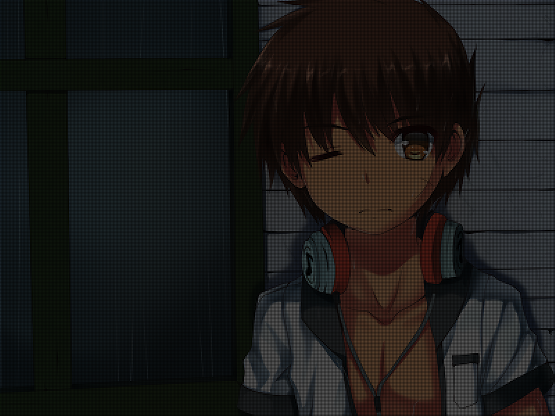

# 某无聊的BMP图像放大测试

这是一个闲来无聊的BMP文件超分辨率实验（纯粹为了玩

## 概述

晚上闲来无聊，想手撸个图像处理玩玩

这次依旧拿P站友人[(ˉ﹃ˉ)EM1234](https://www.pixiv.net/member.php?id=8467971)的图片开刀。

这次要进行的操作是超分辨率。

具体的内容就是，先把图像强行拉大，然后bicubic插值，再用一堆卷积核去卷积。（未来的某天不小心把这个搞成了个CNN也说不定

## 实验内容

### 原始图片：

不要问我为啥总是他，真的很想prpr啊（

### 强行放大（不进行插值）

（这张图片可能需要放大之后才能看到效果了……

### 无聊闲来一次线性插值

已经预计到效果不太好，但是还是放上来了

### 双立方插值

emmmmm

感觉和线性插值区别不大嘛（掀桌子x

### 对双立方插值结果做一次高斯模糊

emmmmm

感觉和插值后什么都不做区别不大嘛（再次掀桌子x

## 阶段总结1

今天的实验到此为止，整理一下目录，准备开始疯狂的卷积

当前的版本是 [5af0f025469986c8c43e9f94991eb0092306de11](https://github.com/yeonzi/BMP-Super-Resolution/commit/5af0f025469986c8c43e9f94991eb0092306de11)